# 🎓 Undergraduate Course: Graph Algorithms

<p>
  
  
  
  
  
  
  
</p>

A small educational repository containing **Python and C++ implementations** of classical **graph algorithms** studied in an undergraduate Computer Science course.

The project focuses on the practical implementation of graph representations and algorithms such as **connected components**, **Dijkstra’s shortest path**, **Kruskal’s minimum spanning tree**, and random graph generation using a simple `.dl` file format.

The goal is to make each algorithm easier to inspect, modify, compile, test, and understand. This repository is educational and is not intended to replace optimized graph libraries such as NetworkX, Boost Graph Library, igraph, or graph-tool.

> 👨‍🏫 **Professor**: [Prof. Dr. Pablo Mayckon Silva Farias](http://lattes.cnpq.br/7678130748412873)

---

## 🧭 Table of Contents

* [Conceptual Map](#-conceptual-map)
* [Main Usage per File](#-main-usage-per-file)
* [Repository Structure](#-repository-structure)
* [Dependencies & Libraries](#-dependencies--libraries)
* [Computational Concepts](#-computational-concepts)
* [Graph Theory Background](#️-graph-theory-background)
* [Graph Definition](#-graph-definition)
* [Directed and Undirected Graphs](#️-directed-and-undirected-graphs)
* [Weighted Graphs](#️-weighted-graphs)
* [Graph Representation](#-graph-representation)
* [Adjacency List](#-adjacency-list)
* [.dl File Format](#-dl-file-format)
* [Algorithms](#-algorithms)
* [Connected Components](#-connected-components)
* [Dijkstra’s Algorithm](#-dijkstras-algorithm)
* [Kruskal’s Algorithm](#-kruskals-algorithm)
* [Current Architecture](#-current-architecture)
* [Test Examples](#-test-examples)
* [Time and Space Complexity](#️-time-and-space-complexity)
* [How to Run](#️-how-to-run)
* [Behavior Summary](#-behavior-summary)
* [Suggested Study Path](#-suggested-study-path)
* [Technologies and Tools](#-technologies-and-tools)
* [Future Improvements](#-future-improvements)
* [Notes](#️-notes)
* [Image Credits and Licenses](#️-image-credits-and-licenses)
* [References and Further Reading](#-references-and-further-reading)
* [License](#-license)

---

## 🧭 Conceptual Map

```mermaid
graph TD
    root["Undergraduate Course: Graph Algorithms"] --> math["Mathematical Graph Model"]
    root --> repr["Graph Representation"]
    root --> algos["Algorithms"]
    root --> files["Repository Files"]
    root --> tests["Test Examples"]

    math --> graph_def["G = (V, E)"]
    math --> directed["Directed Graphs"]
    math --> undirected["Undirected Graphs"]
    math --> weighted["Weighted Graphs"]

    repr --> adj_list["Adjacency List"]
    repr --> edge_list["Edge List"]
    repr --> dl_format[".dl Format"]

    algos --> cc["Connected Components"]
    algos --> dijkstra["Dijkstra's Algorithm"]
    algos --> kruskal["Kruskal's MST"]
    algos --> generator["Random Graph Generator"]

    cc --> bfs["BFS Traversal"]
    cc --> dfs["DFS Alternative"]
    cc --> components["Component Labels"]

    dijkstra --> shortest_paths["Single-Source Shortest Paths"]
    dijkstra --> non_negative["Non-negative Weights"]

    kruskal --> mst["Minimum Spanning Tree"]
    kruskal --> union_find["Disjoint Sets / Union-Find"]
    kruskal --> edge_sorting["Edge Sorting"]

    files --> py["graph_suite.py"]
    files --> hpp["AdjacencyGraph.hpp"]
    files --> cpp["ConnectedComponents.cpp"]

    tests --> stdin["stdin / .dl Input"]
    tests --> cli["CLI Execution"]
    tests --> examples["Python Examples"]
```

---

## ✅ Main Usage per File

| File                      | Description                                                                                                                                                         |
| ------------------------- | ------------------------------------------------------------------------------------------------------------------------------------------------------------------- |
| `graph_suite.py`          | Python script containing graph creation, connected components, Kruskal’s MST, Dijkstra’s algorithm, random graph generation, `.dl` export, and simple CLI routines. |
| `AdjacencyGraph.hpp`      | C++ header defining a template-based graph structure using adjacency lists.                                                                                         |
| `ConnectedComponents.cpp` | C++ program for reading a graph and computing connected components.                                                                                                 |
| `README.md`               | Project documentation and theoretical explanation.                                                                                                                  |

---

## 📂 Repository Structure

```text
graph_algorithms/
│
├── graph_suite.py
├── AdjacencyGraph.hpp
├── ConnectedComponents.cpp
└── README.md
```

If more algorithms are added later, a possible future structure could be:

```text
graph_algorithms/
│
├── cpp/
│   ├── AdjacencyGraph.hpp
│   ├── ConnectedComponents.cpp
│   ├── Dijkstra.cpp
│   └── Kruskal.cpp
│
├── python/
│   └── graph_suite.py
│
├── examples/
│   ├── connected_components_example.dl
│   ├── weighted_graph_example.dl
│   └── directed_graph_example.dl
│
├── tests/
│   └── test_graph_algorithms.py
│
├── docs/
│   └── images/
│
└── README.md
```

---

## 🧠 Dependencies & Libraries

This repository uses only standard Python and C++ resources.

| Tool / Library   | Purpose                                                 |
| ---------------- | ------------------------------------------------------- |
| Python 3.11.5    | Main language for the all-in-one graph algorithm suite. |
| Python `random`  | Random graph generation and random edge weights.        |
| C++17            | Language standard used by the C++ implementations.      |
| C++ STL          | Containers and basic utilities.                         |
| C++ IOStream     | Input and output handling.                              |
| C++ Vector       | Dynamic array representation.                           |
| C++ List         | Linked-list-style adjacency representation.             |
| GCC / G++ 14.2.0 | Compilation of C and C++ source files.                  |

---

## 📘 Computational Concepts

This project demonstrates several important computational concepts:

```text
Graph Theory
Adjacency Lists
Edge Lists
Breadth-First Search
Connected Components
Shortest Path Algorithms
Minimum Spanning Trees
Greedy Algorithms
Disjoint Sets
Algorithmic Complexity
File-Based Graph Input
```

---

## 🕸️ Graph Theory Background

A graph is a mathematical structure used to model relationships between objects.

A graph can represent:

```text
roads between cities
links between web pages
friendships in a social network
dependencies between tasks
connections in a computer network
states and transitions
```

<p align="center">
  
</p>

<p align="center">
  <em>Graph reference image: <a href="https://commons.wikimedia.org/wiki/File:6n-graf.svg">Wikimedia Commons — 6n-graf.svg</a></em>
</p>

---

## 📐 Graph Definition

A graph is commonly represented as:

$$
G = (V, E)
$$

where:

* $V$ is the set of vertices, also called nodes
* $E$ is the set of edges connecting pairs of vertices

For example:

```text
V = {1, 2, 3, 4}
E = {(1, 2), (1, 3), (2, 4)}
```

This means the graph has four vertices and three edges.

---

## ➡️ Directed and Undirected Graphs

A graph may be **directed** or **undirected**.

### Undirected Graph

In an undirected graph, an edge has no direction.

```text
{u, v} means u is connected to v
and v is connected to u
```

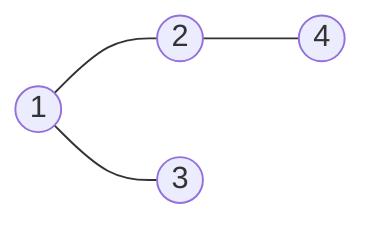

### Directed Graph

In a directed graph, an edge has direction.

```text
(u, v) means u points to v
```

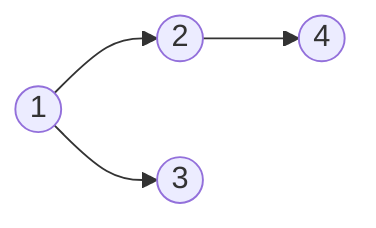

---

## ⚖️ Weighted Graphs

A weighted graph assigns a value to each edge.

This value may represent:

```text
distance
cost
time
capacity
risk
similarity
```

Mathematically, a weighted graph can be represented with a weight function:

$$
w : E \rightarrow \mathbb{R}
$$

Example:

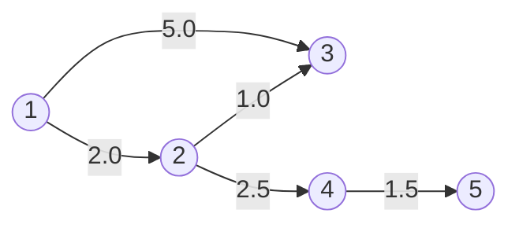

---

## 🧱 Graph Representation

Graphs can be represented in several ways. This repository mainly uses **adjacency lists** and `.dl` edge lists.

---

## 📋 Adjacency List

An adjacency list stores, for each vertex, the list of its neighbors.

For a graph:

```text
1 -> 2
1 -> 3
2 -> 4
3 -> 5
```

The adjacency list is:

```text
Adj[1] = 2, 3
Adj[2] = 4
Adj[3] = 5
Adj[4] = empty
Adj[5] = empty
```

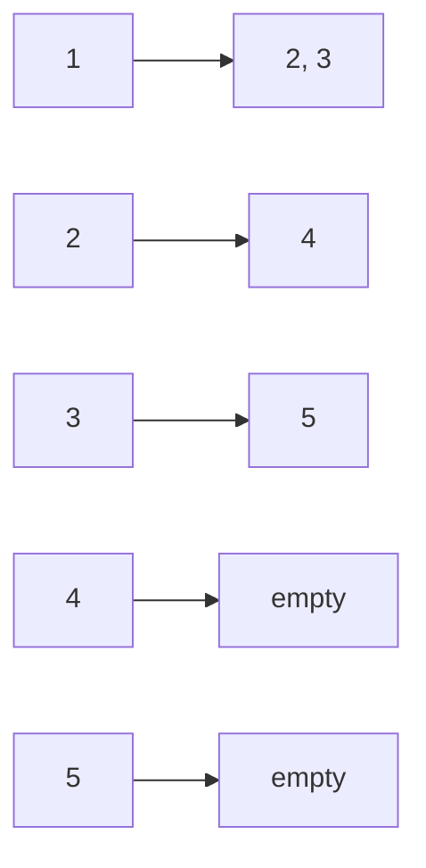

For sparse graphs, adjacency lists are usually more memory-efficient than adjacency matrices.

### Adjacency List Complexity

| Operation                |     Complexity | Explanation                         |
| ------------------------ | -------------: | ----------------------------------- |
| Store graph              |     $O(V + E)$ | Stores each vertex and each edge.   |
| Add edge                 | $O(1)$ average | Appends a neighbor to a list.       |
| Iterate neighbors of `v` |   $O(\deg(v))$ | Visits only neighbors of `v`.       |
| Check if edge exists     |   $O(\deg(v))$ | May need to scan the neighbor list. |

---

## 📄 `.dl` File Format

The repository uses a simple Pajek-compatible `.dl` edge list format.

Example:

```text
dl
format=edgelist1
n=5
data:
1 2
1 3
2 4
3 5
```

Meaning:

```text
The graph has 5 vertices.
The graph edges are:
1 -- 2
1 -- 3
2 -- 4
3 -- 5
```

For weighted graphs, each edge line may include a third value:

```text
1 2 3.5
2 4 7.1
4 5 2.0
```

Meaning:

```text
edge 1 to 2 has weight 3.5
edge 2 to 4 has weight 7.1
edge 4 to 5 has weight 2.0
```

---

## 🚀 Algorithms

This repository contains implementations and demonstrations of classical graph algorithms.

---

## 🔍 Connected Components

Connected components are maximal groups of vertices where every vertex can reach every other vertex in the same group through some path.

This concept applies mainly to **undirected graphs**.

Example:

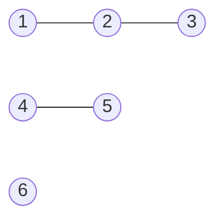

The connected components are:

```text
{1, 2, 3}
{4, 5}
{6}
```

### Behavior

A connected components algorithm usually works by repeatedly starting a traversal from an unvisited vertex.

```text
1. Choose an unvisited vertex.
2. Start BFS or DFS from that vertex.
3. Mark every reachable vertex as part of the same component.
4. Repeat until all vertices are visited.
```

### BFS Flow

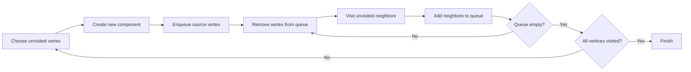

### Complexity

Using BFS or DFS with adjacency lists:

$$
O(V + E)
$$

where:

* $V$ is the number of vertices
* $E$ is the number of edges

| Step                     | Time Complexity | Space Complexity |
| ------------------------ | --------------: | ---------------: |
| Initialize visited array |          $O(V)$ |           $O(V)$ |
| Traverse vertices        |          $O(V)$ |           $O(V)$ |
| Traverse edges           |          $O(E)$ |     $O(1)$ extra |
| Total                    |      $O(V + E)$ |           $O(V)$ |

### Applications

```text
social network cluster detection
image segmentation
network reliability analysis
island counting problems
community detection preprocessing
```

---

## 🧮 Dijkstra’s Algorithm

Dijkstra’s algorithm computes shortest paths from one source vertex to all other vertices in a weighted graph with **non-negative edge weights**.

<p align="center">
  
</p>

<p align="center">
  <em>Dijkstra reference animation: <a href="https://commons.wikimedia.org/wiki/File:Dijkstra_Animation.gif">Wikimedia Commons — Dijkstra_Animation.gif</a></em>
</p>

### Problem

Given:

```text
a weighted graph G = (V, E)
a source vertex s
non-negative edge weights
```

Find:

```text
the shortest distance from s to every other vertex
```

Mathematically:

$$
dist[v] = \min_{\text{paths } s \leadsto v} \sum_{(u, x) \in path} w(u, x)
$$

### Basic Idea

Dijkstra’s algorithm repeatedly selects the unvisited vertex with the smallest known distance and relaxes its outgoing edges.

```text
1. Set distance[source] = 0.
2. Set all other distances = infinity.
3. Select the unvisited vertex with smallest distance.
4. Relax all outgoing edges.
5. Repeat until all reachable vertices are processed.
```

### Relaxation

For an edge $(u, v)$ with weight $w(u, v)$:

$$
dist[v] = \min(dist[v], dist[u] + w(u, v))
$$

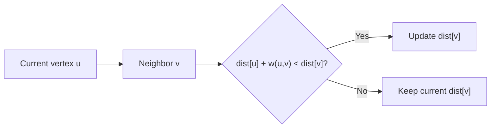

### Complexity

| Implementation             |    Time Complexity | Space Complexity |
| -------------------------- | -----------------: | ---------------: |
| Simple array / list        |       $O(V^2 + E)$ |           $O(V)$ |
| Binary heap priority queue | $O((V + E)\log V)$ |       $O(V + E)$ |
| Fibonacci heap             |   $O(E + V\log V)$ |       $O(V + E)$ |

The Python implementation may use a simple educational approach rather than an aggressively optimized priority queue implementation.

### Applications

```text
GPS navigation
network routing
game AI pathfinding
transportation systems
weighted dependency analysis
```

---

## 🌲 Kruskal’s Algorithm

Kruskal’s algorithm finds a **minimum spanning tree** of a connected, undirected, weighted graph.

A spanning tree connects all vertices using exactly:

$$
V - 1
$$

edges, without cycles.

A minimum spanning tree is the spanning tree with the smallest possible total edge weight.

<p align="center">
  
</p>

<p align="center">
  <em>Minimum spanning tree reference: <a href="https://commons.wikimedia.org/wiki/File:Minimum_spanning_tree.svg">Wikimedia Commons — Minimum_spanning_tree.svg</a></em>
</p>

### Basic Idea

Kruskal’s algorithm is greedy.

```text
1. Sort all edges by increasing weight.
2. Start with an empty forest.
3. Iterate through edges from smallest to largest.
4. Add the edge if it does not create a cycle.
5. Stop when the tree has V - 1 edges.
```

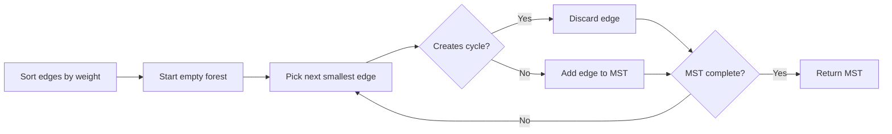

### Disjoint Set / Union-Find

Kruskal’s algorithm usually uses a **Disjoint Set Union** structure to detect cycles efficiently.

The two main operations are:

```text
find(x)    -> returns the representative of x's set
union(a,b) -> merges the sets containing a and b
```

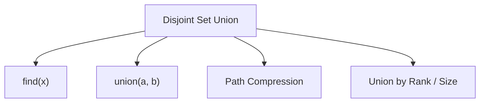

### Complexity

| Step                  |             Complexity | Explanation                            |
| --------------------- | ---------------------: | -------------------------------------- |
| Sort edges            |          $O(E \log E)$ | Dominant step in most implementations. |
| Union-Find operations | $O(E \cdot \alpha(V))$ | Almost constant in practice.           |
| Total                 |          $O(E \log E)$ | Sorting dominates.                     |
| Space                 |             $O(V + E)$ | Stores edges and disjoint sets.        |

Where $\alpha(V)$ is the inverse Ackermann function, which grows extremely slowly.

### Applications

```text
network design
telecommunication infrastructure
electrical grid planning
clustering
image segmentation
approximation preprocessing
```

---

## 🧱 Current Architecture

The repository is intentionally small and easy to inspect.

---

## 🐍 `graph_suite.py`

A Python all-in-one script containing graph algorithms and helper routines.

### Main Features

| Feature                 | Description                                                       |
| ----------------------- | ----------------------------------------------------------------- |
| Graph class             | Represents directed/undirected and weighted/unweighted graphs.    |
| Edge insertion          | Adds edges to the internal representation.                        |
| Connected components    | Computes connected components using traversal logic.              |
| Dijkstra                | Computes shortest paths from a source vertex.                     |
| Kruskal                 | Computes minimum spanning tree total weight.                      |
| Random graph generation | Creates random graphs with configurable size and number of edges. |
| `.dl` export            | Saves generated graphs in a simple `.dl` edge list format.        |
| CLI routines            | Allows educational command-line testing.                          |

### Conceptual Role

```text
graph_suite.py
│
├── Graph representation
├── Graph generation
├── Connected components
├── Dijkstra shortest paths
├── Kruskal MST
└── .dl file output
```

---

## 🧩 `AdjacencyGraph.hpp`

A C++ header file defining a reusable graph structure using adjacency lists.

### Main Features

```text
template-based graph structure
struct-based Node and Graph definitions
dynamic memory allocation
directed edge insertion
adjacency list representation
graph destruction / memory cleanup
```

### Mathematical Representation

The adjacency list stores:

$$
Adj[u] = {v \in V \mid (u, v) \in E}
$$

This means that for each vertex $u$, the program stores all vertices directly reachable from $u$.

### Conceptual Layout

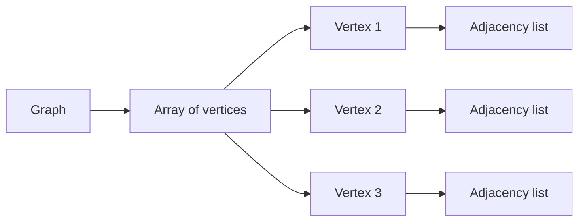

---

## 💻 `ConnectedComponents.cpp`

A C++ implementation focused on connected components and low-level graph handling.

### Main Features

```text
reads graph input
stores adjacency information
uses traversal/merging logic
prints connected components
practices raw pointer manipulation
handles memory allocation and deallocation
```

This file is useful for practicing:

```text
C++ structs
pointers
manual memory management
linked structures
graph traversal
component detection
```

---

## 🧪 Test Examples

Below are small test cases to validate the main algorithms implemented in the repository.

---

## 🔍 Connected Components in C++

### Input File

Create a file named:

```text
connected_components_example.dl
```

with:

```text
dl
format=edgelist1
n=6
data:
1 2
2 3
4 5
```

The graph has three connected components:

```text
{1, 2, 3}
{4, 5}
{6}
```

### Compile

```bash
g++ -std=c++17 ConnectedComponents.cpp -o connected_components
```

### Run

```bash
./connected_components connected_components_example.dl
```

Windows PowerShell:

```powershell
g++ -std=c++17 ConnectedComponents.cpp -o connected_components.exe
.\connected_components.exe connected_components_example.dl
```

### Expected Output

```text
1 2 3
4 5
6
```

---

## 🌲 Kruskal’s MST in Python

### Example Usage

```python
from graph_suite import generate_graph, kruskal_mst

G = generate_graph(
    n_vertices=5,
    n_edges=6,
    filename="kruskal_test.dl",
    directed=False,
    weighted=True
)

mst_weight = kruskal_mst(G)

print(f"MST weight: {mst_weight}")
```

### Example Output

Because the graph is randomly generated, the exact result may vary.

```text
MST weight: 8.732
```

For deterministic testing, manually define a fixed graph instead of using random generation.

---

## 🧮 Dijkstra’s Algorithm in Python

### Example Usage

```python
from graph_suite import Graph, dijkstra

G = Graph(5, directed=True, weighted=True)

G.add_edge(1, 2, 2.0)
G.add_edge(1, 3, 5.0)
G.add_edge(2, 3, 1.0)
G.add_edge(2, 4, 2.5)
G.add_edge(4, 5, 1.5)

distances = dijkstra(G, source=1)

print(distances)
```

### Expected Output

```text
[0, 2.0, 3.0, 4.5, 6.0]
```

The shortest paths from vertex `1` are:

| Vertex | Shortest Distance |
| ------ | ----------------: |
| `1`    |               `0` |
| `2`    |             `2.0` |
| `3`    |             `3.0` |
| `4`    |             `4.5` |
| `5`    |             `6.0` |

---

## 📄 Graph Generation to `.dl`

### Example Usage

```python
from graph_suite import generate_graph

generate_graph(
    n_vertices=4,
    n_edges=4,
    filename="example_graph.dl",
    directed=False,
    weighted=True
)
```

### Example Output File

```text
dl
format=edgelist1
n=4
data:
1 3 7.421
1 2 3.057
2 4 5.111
3 4 6.228
```

This file can then be inspected manually or reused as input for compatible graph algorithms.

---

## ⏱️ Time and Space Complexity

Let:

```text
V = number of vertices
E = number of edges
```

---

## General Complexity Summary

| Algorithm / Operation             |                        Time Complexity | Space Complexity |
| --------------------------------- | -------------------------------------: | ---------------: |
| Build adjacency list              |                             $O(V + E)$ |       $O(V + E)$ |
| Add one edge                      |                         $O(1)$ average |           $O(1)$ |
| Iterate neighbors of vertex `v`   |                           $O(\deg(v))$ |           $O(1)$ |
| Connected components with BFS/DFS |                             $O(V + E)$ |           $O(V)$ |
| Dijkstra with simple list         |                           $O(V^2 + E)$ |       $O(V + E)$ |
| Dijkstra with binary heap         |                     $O((V + E)\log V)$ |       $O(V + E)$ |
| Kruskal MST                       |                           $O(E\log E)$ |       $O(V + E)$ |
| Random graph generation           | Depends on duplicate checking strategy |       $O(V + E)$ |
| Read `.dl` file                   |                             $O(V + E)$ |       $O(V + E)$ |

---

## Space Complexity Notes

The main memory usage comes from storing:

```text
vertices
edges
adjacency lists
visited arrays
distance arrays
parent arrays
Union-Find structures
```

For most algorithms in this repository, the dominant space cost is:

$$
O(V + E)
$$

This is expected for adjacency-list-based graph implementations.

---

## ▶️ How to Run

## Python

Run the Python graph suite directly:

```bash
python graph_suite.py
```

Windows PowerShell:

```powershell
python graph_suite.py
```

or:

```powershell
py graph_suite.py
```

---

## C++ Connected Components

Compile:

```bash
g++ -std=c++17 ConnectedComponents.cpp -o connected_components
```

Run:

```bash
./connected_components input_file.dl
```

Windows PowerShell:

```powershell
g++ -std=c++17 ConnectedComponents.cpp -o connected_components.exe
.\connected_components.exe input_file.dl
```

---

## 🧪 Behavior Summary

This repository demonstrates how graph algorithms operate over explicit graph representations.

```text
1. A graph is represented as vertices and edges.
2. Edges can be directed or undirected.
3. Edges can optionally have weights.
4. Adjacency lists store neighbors efficiently.
5. Connected components group reachable vertices.
6. Dijkstra computes shortest paths from one source.
7. Kruskal finds a minimum spanning tree.
8. Union-Find helps detect cycles in Kruskal.
9. Random graph generation creates test instances.
10. .dl files allow simple graph input and output.
```

---

## 🧭 Suggested Study Path

A good study order for this repository is:

```text
1. Graph definition: G = (V, E)
2. Directed vs undirected graphs
3. Weighted vs unweighted graphs
4. Edge list format
5. Adjacency list representation
6. Graph traversal
7. Connected components
8. Shortest path problem
9. Dijkstra’s algorithm
10. Minimum spanning tree problem
11. Kruskal’s algorithm
12. Disjoint Set Union / Union-Find
13. Complexity analysis
14. File-based testing with .dl files
```

This order starts with basic graph theory and gradually moves toward algorithmic implementation details.

---

## 🧰 Technologies and Tools

| Tool / Language   | Purpose                                                 |
| ----------------- | ------------------------------------------------------- |
| Python            | High-level implementation and quick testing.            |
| C++17             | Lower-level implementation and data structure practice. |
| GCC / G++         | Compilation of C++ files.                               |
| Standard Library  | Data containers, input/output, and utility functions.   |
| Bash / PowerShell | Running examples from the terminal.                     |
| `.dl` files       | Simple graph input/output format.                       |
| Mermaid           | Diagrams rendered directly in GitHub Markdown.          |

---

## 🧭 Future Improvements

Possible improvements include:

* Add DFS implementation
* Add BFS shortest path for unweighted graphs
* Add Prim’s MST algorithm
* Add Bellman-Ford algorithm
* Add Floyd-Warshall algorithm
* Add topological sorting
* Add cycle detection
* Add strongly connected components
* Add bipartite graph checking
* Add graph coloring examples
* Add priority queue optimization for Dijkstra
* Add explicit Union-Find implementation documentation
* Add unit tests for each algorithm
* Add deterministic graph fixtures for testing
* Add CMake support
* Add Makefile
* Add GitHub Actions for automated builds
* Add benchmark scripts
* Add visualization scripts
* Add examples using real-world graph datasets
* Add support for adjacency matrix representation
* Add parser validation for malformed `.dl` files
* Add separate folders for Python, C++, tests, and examples

---

## ⚠️ Notes

* This project is educational and experimental.
* The algorithms prioritize clarity over maximum performance.
* Some implementations may use simplified data structures to make the logic easier to understand.
* Dijkstra’s algorithm requires non-negative edge weights.
* Kruskal’s algorithm is designed for undirected weighted graphs.
* Connected components are usually defined for undirected graphs.
* For production-grade graph processing, consider specialized libraries.
* For large graphs, memory usage and input parsing strategy become important.

---

## 🖼️ Image Credits and Licenses

| Image                         | Source            | License information               | Link                                                                           |
| ----------------------------- | ----------------- | --------------------------------- | ------------------------------------------------------------------------------ |
| Graph example                 | Wikimedia Commons | See file page for license details | [File page](https://commons.wikimedia.org/wiki/File:6n-graf.svg)               |
| Dijkstra animation            | Wikimedia Commons | See file page for license details | [File page](https://commons.wikimedia.org/wiki/File:Dijkstra_Animation.gif)    |
| Minimum spanning tree example | Wikimedia Commons | See file page for license details | [File page](https://commons.wikimedia.org/wiki/File:Minimum_spanning_tree.svg) |

---

## 📚 References and Further Reading

The following references are useful for studying graph theory, graph algorithms, data structures, and algorithmic complexity.

### Books

| Reference                                                                                               | Main Topic                     | Why it is useful                                                                       | Link                                                                                                                 |
| ------------------------------------------------------------------------------------------------------- | ------------------------------ | -------------------------------------------------------------------------------------- | -------------------------------------------------------------------------------------------------------------------- |
| Thomas H. Cormen, Charles E. Leiserson, Ronald L. Rivest, Clifford Stein — *Introduction to Algorithms* | Algorithms and graph theory    | Standard reference for BFS, DFS, shortest paths, MSTs, and complexity analysis.        | [MIT Press](https://mitpress.mit.edu/9780262046305/introduction-to-algorithms/)                                      |
| Robert Sedgewick and Kevin Wayne — *Algorithms, 4th Edition*                                            | Algorithms and data structures | Clear treatment of graph representations, graph traversal, MSTs, and shortest paths.   | [Official site](https://algs4.cs.princeton.edu/home/)                                                                |
| Jon Kleinberg and Éva Tardos — *Algorithm Design*                                                       | Algorithm design               | Excellent explanations of greedy algorithms, graph algorithms, and correctness proofs. | [Pearson](https://www.pearson.com/en-us/subject-catalog/p/algorithm-design/P200000003214)                            |
| Steven S. Skiena — *The Algorithm Design Manual*                                                        | Practical algorithms           | Useful for algorithmic intuition, graph problems, and implementation considerations.   | [Springer](https://link.springer.com/book/10.1007/978-3-030-54256-6)                                                 |
| Mark Allen Weiss — *Data Structures and Algorithm Analysis in C++*                                      | Data structures in C++         | Helpful for implementing graph structures and analyzing performance in C++.            | [Pearson](https://www.pearson.com/en-us/subject-catalog/p/data-structures-and-algorithm-analysis-in-c/P200000003386) |

---

### Online Resources

| Resource                       | Main Topic                         | Why it is useful                                                                           | Link                                                                                                                       |
| ------------------------------ | ---------------------------------- | ------------------------------------------------------------------------------------------ | -------------------------------------------------------------------------------------------------------------------------- |
| Python Documentation           | Python                             | Official reference for Python syntax and standard libraries.                               | [docs.python.org](https://docs.python.org/3/)                                                                              |
| cppreference                   | C++                                | Reference for C++ containers, algorithms, and language features.                           | [en.cppreference.com](https://en.cppreference.com/)                                                                        |
| GCC Documentation              | Compilation                        | Official GCC documentation for compiling C and C++ programs.                               | [GCC Docs](https://gcc.gnu.org/onlinedocs/)                                                                                |
| VisuAlgo                       | Algorithm visualization            | Interactive visualizations for graph traversal, MSTs, shortest paths, and data structures. | [VisuAlgo](https://visualgo.net/)                                                                                          |
| CP-Algorithms                  | Competitive programming algorithms | Practical explanations of graph algorithms and data structures.                            | [CP-Algorithms](https://cp-algorithms.com/)                                                                                |
| NetworkX Documentation         | Graph library                      | Useful for comparing manual implementations with a production Python graph library.        | [NetworkX Docs](https://networkx.org/documentation/stable/)                                                                |
| GitHub Docs — Mermaid diagrams | Markdown diagrams                  | Explains how to write Mermaid diagrams inside GitHub Markdown.                             | [GitHub Docs](https://docs.github.com/en/get-started/writing-on-github/working-with-advanced-formatting/creating-diagrams) |

---

## 📄 License

This project is available for educational and study purposes.

If a license file is added to the repository, refer to `LICENSE` for usage terms.
